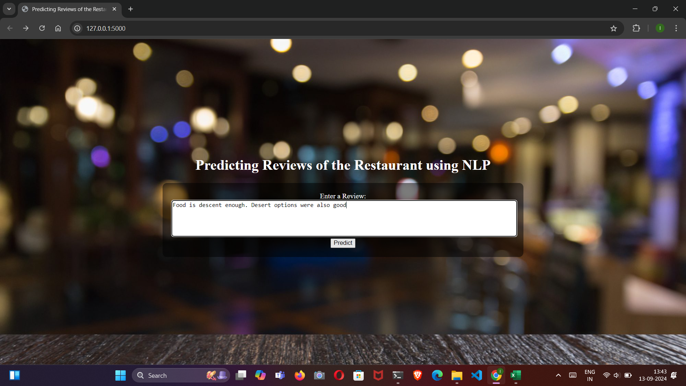
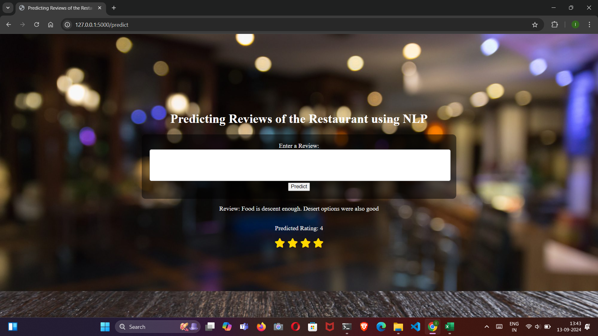
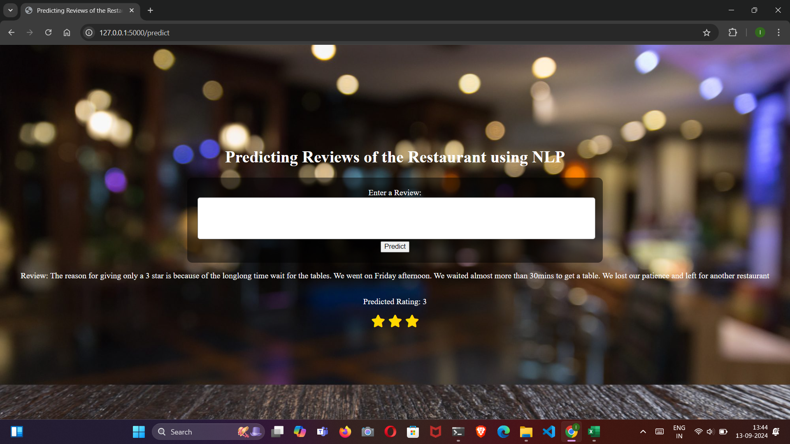
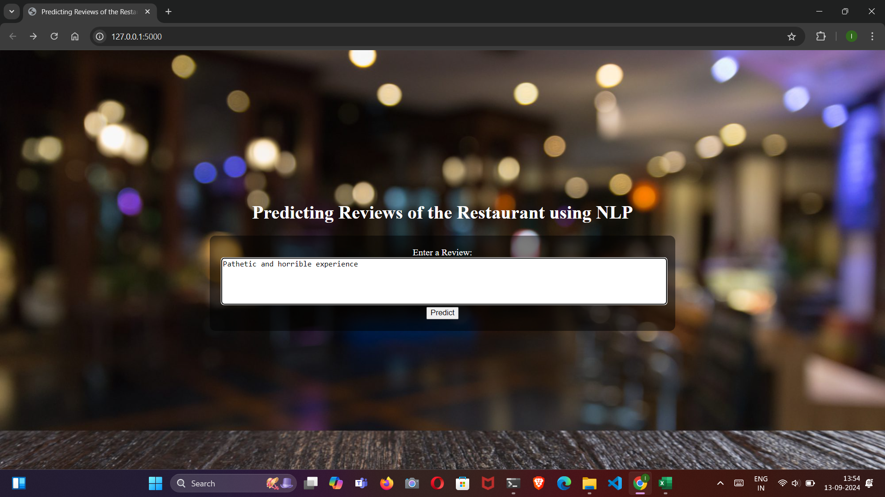
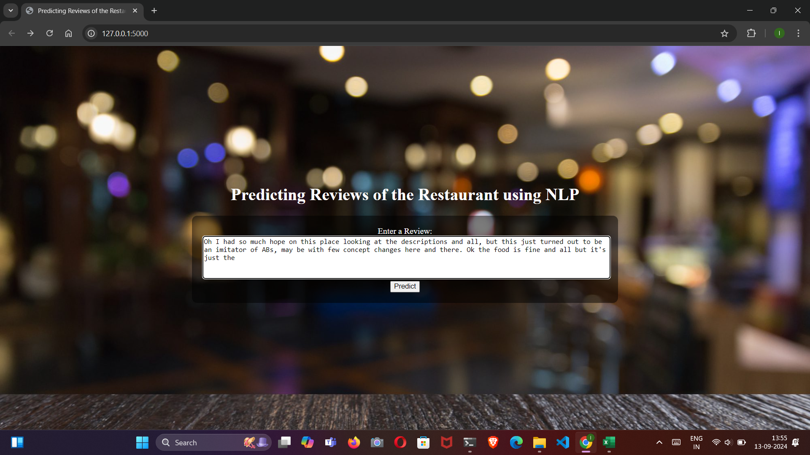

# Project Title

# *Predicting Restaurant Review Ratings Using NLP and BERT*

### Problem Statement:
The goal of this project is to predict restaurant review ratings (1-5 stars) based on the text provided in user reviews. By leveraging advanced Natural Language Processing (NLP) techniques and the BERT model, the application can analyze the sentiment and context of a review and accurately predict the corresponding star rating. This solution can help restaurants and businesses quickly assess customer feedback and take action to improve customer satisfaction. The system provides real-time predictions and is designed to be both efficient and scalable for practical applications.


### Features:

- **Star Rating Prediction (1-5 Stars):** The application predicts a restaurant review's star rating based on the sentiment and context of the review text.
- **Real-Time Predictions:** Users can input a review, and the model will provide an instant rating prediction.
- **BERT for Sequence Classification:** Utilizes the BERT (Bidirectional Encoder Representations from Transformers) model for advanced natural language understanding and accurate sentiment analysis.
- **Preprocessing and Tokenization:** The review text is tokenized and preprocessed, including padding and truncation, to fit BERT's input requirements.
- **Flask Web Interface:** A simple and interactive web application where users can submit reviews and receive predictions.
- **PyTorch for Model Inference:** Powered by PyTorch to handle the model's inference efficiently.
- **Scalable and Extendable:** The design allows for easy scaling or adaptation to other sentiment-based prediction tasks in various domains.
## 🔗 Links
[](https://aicraftalchemy.github.io/)
[](https://www.linkedin.com/in/lokesh-e-60a583201)


## 🛠 Skills
Machine Learning, Deep Learning , NLP 

## NOTE
Before you clone this repo make sure you run the ipynb  file and after getting the trained files then  clone the repo and place the trained  files in bert_sentiment_model folder 

## Installation
  
 ```bash
   pip install Flask
   pip install torch
   pip install transformers
```


    

# Learnings and Challenges

1. **Learned:** Gained experience with BERT for NLP tasks and integrating machine learning models with Flask for real-time predictions.
2. **Challenge:** Ensuring correct model and tokenizer loading; resolved by validating checkpoints and following library documentation.
3. **Challenge:** Handling input preprocessing and padding for BERT; implemented a robust tokenization function.
4. **Challenge:** Efficient model inference without gradients; used `torch.no_grad()` for optimization.
5. **Challenge:** Creating a user-friendly web interface; designed intuitive forms and displayed predictions clearly.

### Optimizations

 **NLP Model Choice:** Used BERT for superior sentiment analysis accuracy over traditional algorithms.
 
 **Preprocessing:** Implemented streamlined tokenization and padding to ensure consistency and compatibility with BERT.
## Run Locally

Clone the project

```bash
  git clone https://github.com/AICraftAlchemy/Restaurent-Reviews-Ratings
```

Go to the project directory

```bash
  cd Restaurent-Reviews-Ratings
```

Install dependencies

```bash
  pip install -r requirements.txt
```

Start the server in terminal

```bash
  python app.py
```

### Screenshots

Below are screenshots demonstrating the project:










These images showcase the functionality and user interface of the application.
## Support

For support, email aicraftalchemy@gmail.com 


## Feedback

If you have any feedback, please reach out to us at aicraftalchemy@gmail.com

Phone: 7661081043

